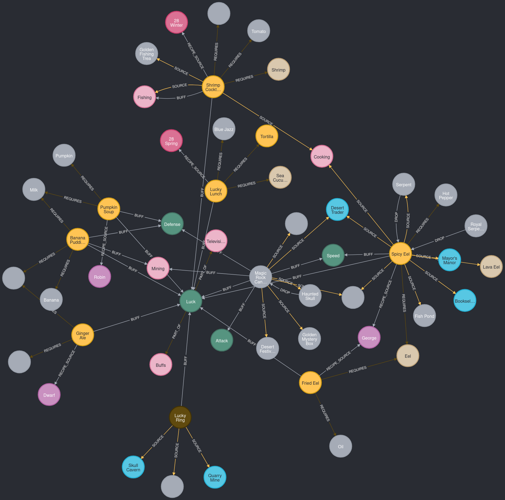

# StardewGraph: a knowledge graph for Stardew Valley

This project uses Neo4j to represent the [stardew valley wiki](https://wiki.stardewvalley.net/Stardew_Valley_Wiki)



## Prerequisites

Docker

## Installation

```sh
docker compose up -d
```

## Usage

Make queries in Neo4j browser (login neo4j/password):

```
http://localhost:7474/browser/
```

See examples in [gallery.ipynb](gallery.ipynb)

## Project Structure

```tree
.
├── docker-compose.yml
├── Dockerfile
├── gallery.ipynb
├── README.md
├── requirements.txt
└── stardewkg
    ├── definitions.py
    ├── __init__.py
    ├── llm_json_formatter.py
    ├── neo4j
    │   ├── readers
    │   ├── run_writers.py
    │   └── writers
    │       ├── body.py
    │       ├── general.py
    │       └── infobox.py
    ├── source_parser.py
    ├── sources_loader.py
    └── utils
        ├── __init__.py
        ├── neo4j_utils.py
        └── utils.py
```

## Contributing

Contributions are welcome! Please open an issue or submit a pull request.

Here are some possible improvements:

- The data already present in the knowledge graph is not perfect.
- Missing data:
  - Calendar
  - Shops
  - Quests
  - Villagers' schedule
  - ...

## License

[Creative Commons Attribution-NonCommercial-ShareAlike](https://creativecommons.org/licenses/by-nc-sa/3.0/)